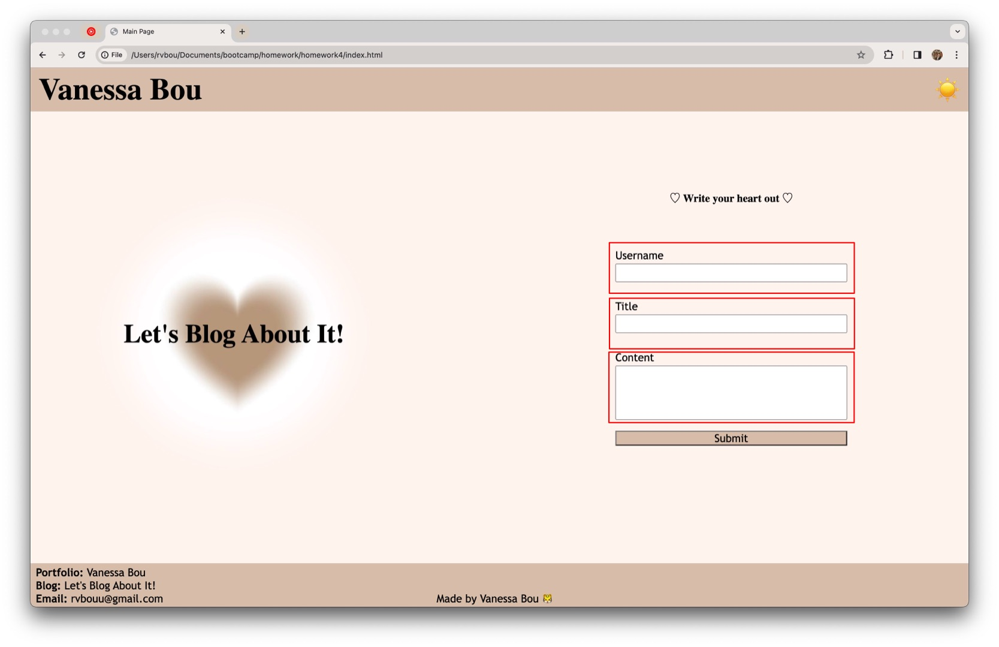
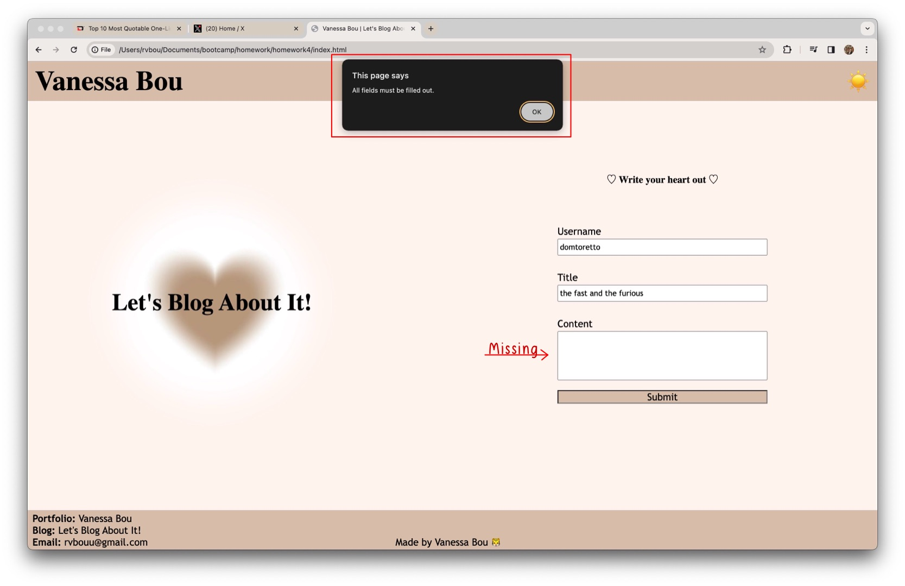
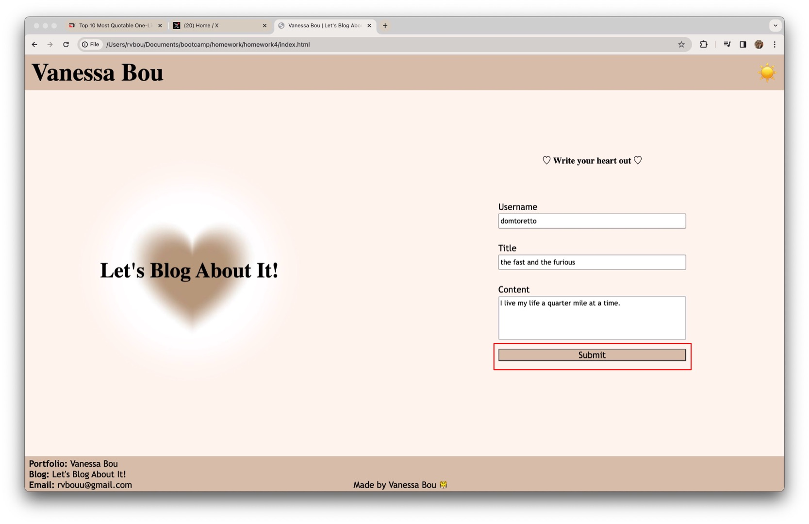
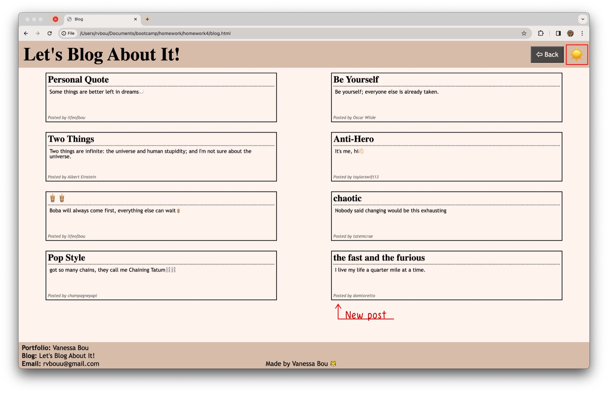
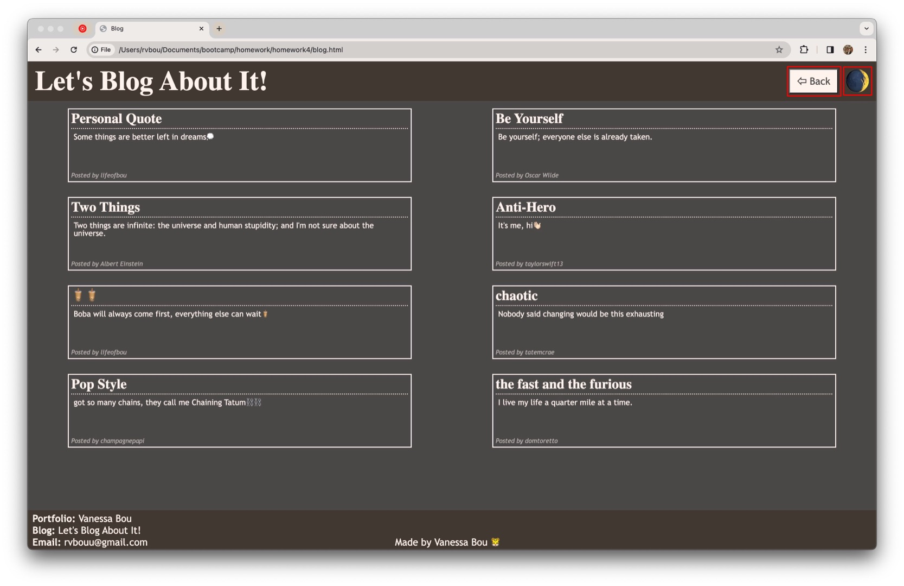
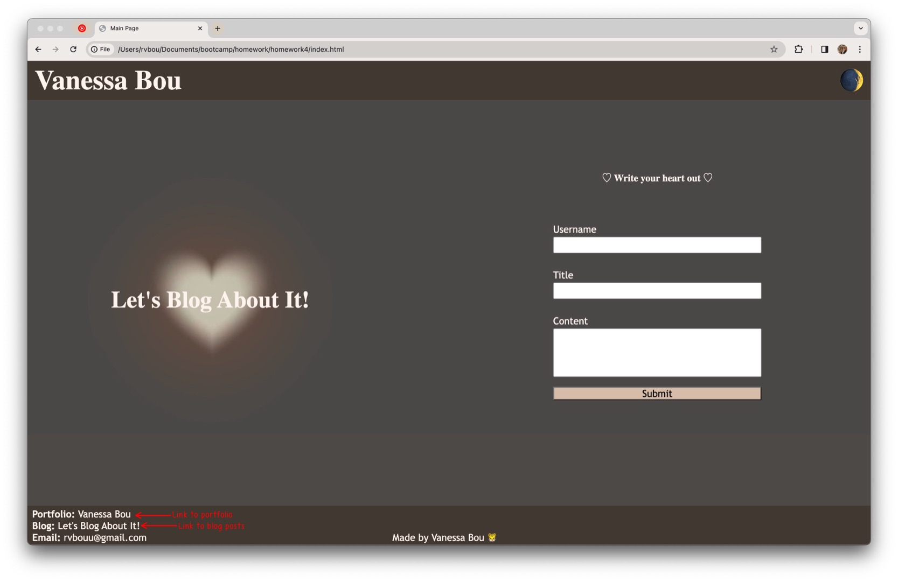

# Personal Blog

## Description

This Personal Blog application is a two-page website where users can input and view blog posts. It includes a form where users will input their username, title of their post, and content on the homepage; a dark/light mode toggle; and a second page that displays previous posts which are rendered dynamically with data from the localStorage.

## Usage

When a user first opens the homepage, they are greeted with a form with three fields: Username, Title, and Content.

When filling out the form, if the user clicks "Submit" but all fields are not completed, an alert will appear on the screen.

After the user fills out all fields and clicks "Submit",

the user will automatically be redirected to the blog posts page. On this page, they will see previously submitted posts along with the post they just submitted. In the header, the user will see a "sun" emoji: when clicked, it changes the page from light to dark mode.

When the page is switch to dark mode, the "sun" emoji will change to a "moon" emoji. Next to the dark mode toggle, the user will also see a back button. When clicked,

the user will be redirected back to the home page. If the user had switched to dark mode on the blog post page, the settings will be kept when they switch back to the homepage and vice versa. In the footer of both pages, the user will find a link to the developer's portfolio and a link to the blog post page so they are able to access it without having to always submit a post.

## Screenshot

## Deployed Application

[Click here]() to view the deployed version.